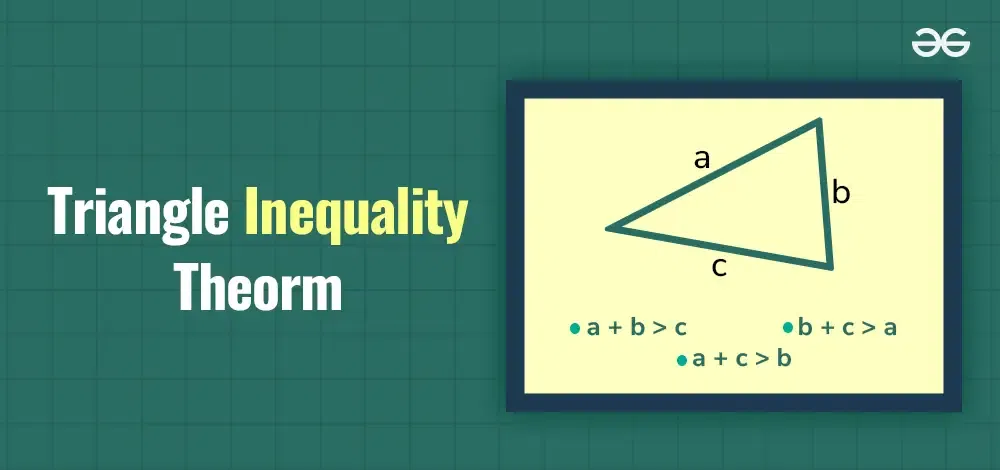
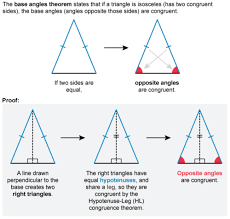

<!-- 
 @requires
 1. VSCode extension: Markdown Preview Enhanced
 2. Shortcut: 'Ctrl' + 'Shift' + 'V'
 3. Split: Drag to right (->)

 @requires
 1. VSCode extension: Markdown All in One
 2. `File` > `Preferences` > `Keyboard Shortcuts`
 3. toggle code span > `Ctrl + '`
 4. toggle code block > `Ctrl + Shift + '`

 @usage
 1. End of Proof (Q.E.D.): 
&#11035;

 2. End of Each Section: 

        

     ---

     
(<a href="#readme-top">back to top</a>)

 3. 
 4. [url_title](URL)
 -->
<!-- Anchor Tag (Object) for "back to top" -->
 

## Table of Contents
- [CS: JAVA](#cs-java)
  - [Announcement](#announcement)
    - [Key Changes:](#key-changes)
    - [Actions Required:](#actions-required)
- [Math: SAT](#math-sat)
  - [Triangle Inequality Theorem](#triangle-inequality-theorem)
    - [Math Terms](#math-terms)
    - [1 Example](#1-example)
    - [2 Example](#2-example)
    - [Real-Life Analogy](#real-life-analogy)
    - [Key Rule](#key-rule)
    - [Practice Problems](#practice-problems)
    - [Conclusion](#conclusion)
  - [Factored Form](#factored-form)
    - [Example](#example)
    - [Steps](#steps)
    - [Types of Factoring](#types-of-factoring)
  
---

# CS: JAVA

## Announcement
A major update to our Java lecture series! To better support large-scale workflows, we'll be adopting Gradle as our primary build automation tool.

### Key Changes:
* Improved project structure for easier navigation
* Enhanced learning materials and resources
* Large-scaled development experience with Gradle

### Actions Required:

To ensure a smooth transition, please fill out the following form to schedule your online meeting:

* **Meeting Date:** January 4th, 2025(After korea travel)
* **Meeting Time:** 6:00 pm
* **Time Zone:** USA GA
* **Meeting Platform (e.g. Zoom, Google Meet, Skype):** Zoom

   

---

# Math: SAT

## Triangle Inequality Theorem  

The Triangle Inequality Theorem states that:  

> The sum of the lengths of any two sides of a triangle must be *greater* than the length of the third side.

### Math Terms
For any triangle with sides a, b, and c:  
- a + b > c  
- a + c > b  
- b + c > a

---

### 1 Example
If the sides are 3, 4, and 8:  
- 3 + 4 = 7, which is not greater than 8.  
*No triangle can be formed.

---

### 2 Example
If the sides are 3, 4, and 6:  
- *3 + 4 = 7, which is greater than 6.  
 A triangle can be formed  

---

### Real-Life Analogy

Think of a triangle as a path:  
- You want to walk from Point A to Point B to Point C.  
- If two paths are too short, it’s like walking in a straight line—no triangle is possible.  

**Key Idea**: You can’t “bend” short sides to form a triangle.  

---

### Key Rule

For any triangle with sides a, b, and c:  

- a + b > c
- a + c > b  
- b + c > a  

If even **one** of these is false, you **cannot** form a triangle!  

---

### Practice Problems

1. Can a triangle have sides 5, 7, and 12?  
   A: No(Jayden)
2. Can a triangle have sides 6, 8, and 1?  
   A: Yes(Jayden)
3. Can a triangle have sides 2, 2, and 5?  
   A: No(Jayden)
4. Can a triangle have sides 4, 4, and 7?  
   A: Yes(Jayden)

---

### Conclusion

The **Triangle Inequality Theorem** ensures a triangle can exist. Always check:  

> The sum of any two sides must be greater than the third side.

Remember: No Sum, No Triangle!

---

## Factored Form
> Factored form is a way of writing a mathematical expression as a product of its factors. For example, instead of expanding an equation like x²+5x+6, you write it as (x+2)(x+3), which shows its factors.

### Example

1. **Factoring Out the GCF**  
   Factor 12x² + 18x:  
   GCF = 6x
   Here is retyped example! $12 x^2$
   Here is retyped example! 
   $$
    12x^2+18x = 6x(2x+3)
   $$

2. **Factoring a Trinomial**  
   Factor $x^2 + 7x + 10$:  
   Find numbers that multiply to 10 and add to 7 → 2 and 5.  
   x² + 7x + 10 = (x + 2)(x + 5)

3. **Factoring by Grouping**
   Factor 2x³ + 4x² + 3x + 6:  
   Group terms: (2x³ + 4x²) + (3x + 6)  
   Factor GCF: 2x²(x + 2) + 3(x + 2)
   Combine: (2x² + 3)(x + 2)

4. **Factoring a Difference of Squares**  
   Factor x² - 49:  
   x² - 49 = (x + 7)(x - 7)

---

### Steps

Follow these steps to factor any expression:

1. Look for a **GCF**:  
   Factor out the greatest common factor from all terms.

2. Count the terms:  
   - 2 terms → Check for a difference of squares.  
   - 3 terms → Factor as a trinomial.  
   - 4 terms → Try factoring by grouping.  

3. Factor step by step:  
   Use methods like the **AC Method** for trinomials.

4. Check for special cases:  
   Recognize patterns like perfect squares or differences of squares.

5. Verify:  
   Expand your factors to ensure they match the original expression.

---

### Types of Factoring

**Factoring Out the GCF**

Always start by factoring out the **greatest common factor**.  

Example:  
- 6x² + 12x
- GCF = 6x
- 6x² + 12x = 6x(x + 2)  

**Factoring Trinomials**

For an expression in the form **ax² + bx + c**:  
- Find two numbers that multiply to ac and add to b.

Example:  
x² + 5x + 6
The numbers that *multiply* to 6 and add to 5 are **2 and 3**.  
x² + 5x + 6 = (x + 2)(x + 3)

**Factoring by Grouping**

Use grouping when there are **4 terms**.  

Example:  
x³ + 2x² + x + 2

Group terms:  
(x³ + 2x²) + (x + 2)  
Factor out the GCF from each group:  
x²(x + 2) + 1(x + 2)
Combine:  
(x² + 1)(x + 2)  

**Factoring Special Cases**

1. Difference of Squares:  
   a² - b² = (a + b)(a - b)

   Example:  
   x² - 16 = (x + 4)(x - 4)

2. Perfect Square Trinomials:  
   - a² + 2ab + b² = (a + b)²  
   - a² - 2ab + b² = (a - b)²  

   Example:  
   - x² + 6x + 9 = (x + 3)²  

---

---

(<a href="#readme-top">back to top</a>)

   

