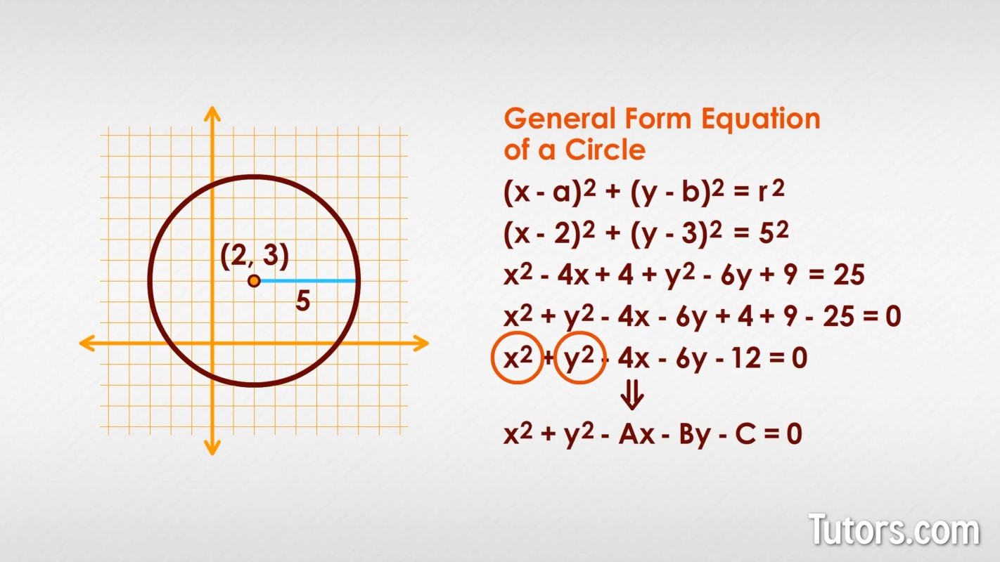

<!-- 
 @requires
 1. VSCode extension: Markdown Preview Enhanced
 2. Shortcut: 'Ctrl' + 'Shift' + 'V'
 3. Split: Drag to right (->)

 @requires
 1. VSCode extension: Markdown All in One
 2. `File` > `Preferences` > `Keyboard Shortcuts`
 3. toggle code span > `Ctrl + '`
 4. toggle code block > `Ctrl + Shift + '`

 @usage
 1. End of Proof (Q.E.D.): <div style="text-align: right;">&#11035;</div>
 2. End of Each Section: 

     <br /><br /><br />

     ---


     <p align="right">(<a href="#readme-top">back to top</a>)</p>

 3. 
 4. [url_title](URL)
 -->
<!-- Anchor Tag (Object) for "back to top" -->
<a id="readme-top"></a> 


## Table of Contents
- [CS: JAVA](#cs-java)
  - [Announcement](#announcement)
    - [Key Changes:](#key-changes)
    - [Actions Required:](#actions-required)
- [Math: SAT](#math-sat)
  - [Absolute Value](#absolute-value)
    - [Definition](#definition)
    - [Examples](#examples)
    - [Graphical Definition](#graphical-definition)
    - [Solving Absolute Value Equations](#solving-absolute-value-equations)
    - [Absolute Value Inequalities](#absolute-value-inequalities)
    - [Key Properties of Absolute Value](#key-properties-of-absolute-value)
    - [Summary Table](#summary-table)
  - [Circle](#circle)
    - [Definition](#definition-1)
- [CS: PYTHON](#cs-python)
  - [HW (special): Elemental Clash Lite](#hw-special-elemental-clash-lite)
    - [Future Improvements (Homework)](#future-improvements-homework)
    - [Features](#features)
      - [Gameplay Mechanics](#gameplay-mechanics)
      - [Game Modes](#game-modes)
    - [Controls](#controls)
      - [Player 1](#player-1)
      - [Player 2](#player-2)


<br /><br /><br />

---


# CS: JAVA

## Announcement
A major update to our Java lecture series! To better support large-scale workflows, we'll be adopting Gradle as our primary build automation tool.

### Key Changes:
* Improved project structure for easier navigation
* Enhanced learning materials and resources
* Large-scaled development experience with Gradle

### Actions Required:

To ensure a smooth transition, please fill out the following form to schedule your online meeting:

* **Meeting Date:** January 4th, 2025(After korea travel)_____________________________________________
* **Meeting Time:** 6:00 pm
* **Time Zone:** USA GA
* **Meeting Platform (e.g. Zoom, Google Meet, Skype):** Zoom


<p align="right">(<a href="#readme-top">back to top</a>)</p>


<br /><br /><br />

---

# Math: SAT


## Absolute Value

In mathematics, the **absolute value** of a number refers to its *distance* from zero on a number line, regardless of its direction (positive or negative).

### Definition
The absolute value of a number \( x \) is denoted as \( |x| \).

\[
|x| = \begin{cases} 
    x & \text{if } x \geq 0 \\
    -x & \text{if } x < 0
\end{cases}
\]

This means:
- If \( x \) is positive or zero, the absolute value is \( x \).
- If \( x \) is negative, the absolute value is \( -x \), which makes it positive.

### Examples
1. \( |5| = 5 \) (\( 5 \) is already positive, so it stays the same).
2. \( |-7| = 7 \) (\( -7 \) is negative, so we take \( -(-7) = 7 \)).
3. \( |0| = 0 \) (The absolute value of zero is zero).

### Graphical Definition
The absolute value represents the distance from zero:
- \( |3| = 3 \) means \( 3 \) is 3 units away from zero.
- \( |-3| = 3 \) means \( -3 \) is also 3 units away from zero.

```
Number Line:
<--- -3  -2  -1   0   1   2   3 --->
|3| = 3 and |-3| = 3
```

### Solving Absolute Value Equations
To solve equations involving absolute values, you need to split the equation into two cases because the value inside the absolute value can be positive or negative.

**Example:** Solve \( |x| = 4 \).

\[
|x| = 4 \implies \begin{cases}
    x = 4 \\
    x = -4
\end{cases}
\]

So the solutions are \( x = 4 \) and \( x = -4 \).

### Absolute Value Inequalities
1. **For \( |x| < a \) (where \( a > 0 \))**:
   \[
   |x| < a \implies -a < x < a
   \]
   Example: \( |x| < 3 \implies -3 < x < 3 \).

2. **For \( |x| > a \) (where \( a > 0 \))**:
   \[
   |x| > a \implies x < -a \; \text{or} \; x > a
   \]
   Example: \( |x| > 3 \implies x < -3 \; \text{or} \; x > 3 \).

### Key Properties of Absolute Value
1. **Non-negativity**: \( |x| \geq 0 \).
2. **Identity**: \( |x| = 0 \iff x = 0 \).
3. **Multiplicative Property**: \( |a \cdot b| = |a| \cdot |b| \).
4. **Additive Property**: \( |a + b| \leq |a| + |b| \) (Triangle Inequality).

### Summary Table
| Input (\( x \)) | Output (\( |x| \)) |
|-----------------|-------------------|
| 5               | 5                 |
| -7              | 7                 |
| 0               | 0                 |
| -12             | 12                |

---

Now you know that absolute value focuses only on the magnitude of a number (how far it is from zero) without worrying about its sign!


## Circle

### Definition




<p align="right">(<a href="#readme-top">back to top</a>)</p>


<br /><br /><br />

---


# CS: PYTHON


## HW (special): Elemental Clash Lite

**Elemental Clash Lite** is a 2D side-view fighting game built with Python's Pygame library. Players control fighters with unique elemental powers in exciting battles within interactive arenas. The game features local multiplayer and single-player story modes.

### Future Improvements (Homework)
- Players must be bounded to the screen, use `if-statement` to do it.
- Key down of `s` and `d` are duplicated with player 1's action, identify the bug and fix it. (`if-statement`)
- AI towards the right, not left, fix it by using mathematical concept, a transformation `reflection over y-axis`.
- Use `for-loop`, to randomly generate some obstacles in the arena.
- [extra] AI opponents in single-player mode.

### Features

#### Gameplay Mechanics
- **Health System**: Each character starts with 100 HP.
- **Basic Attacks**: Perform punches and combine them with special moves for combos.
- **Special Moves**: Each fighter has two unique elemental abilities, such as fireballs or healing waves.
- **Interactive Arenas**: Fixed environments with potential hazards and effects.

#### Game Modes
- **Story Mode**: A single-player campaign against 5 predefined enemies, culminating in a final boss fight.
- **Multiplayer Mode**: A local 2-player mode using the keyboard or two controllers.

### Controls

#### Player 1
- **Movement**: Arrow keys (← →).
- **Jump**: Up Arrow (↑).
- **Basic Attack**: Space.
- **Special Move 1**: S.
- **Special Move 2**: D.

#### Player 2
- **Movement**: WASD (A/D for left/right).
- **Jump**: W.
- **Basic Attack**: F.
- **Special Move 1**: G.
- **Special Move 2**: H.


<p align="right">(<a href="#readme-top">back to top</a>)</p>