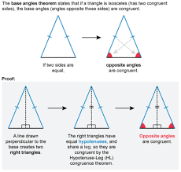

<!--
 @requires
 1. VSCode extension: Markdown Preview Enhanced
 2. Shortcut: 'Ctrl' + 'Shift' + 'V'
 3. Split: Drag to right (->)


 @requires
 1. VSCode extension: Markdown All in One
 2. `File` > `Preferences` > `Keyboard Shortcuts`
 3. toggle code span > `Ctrl + '`
 4. toggle code block > `Ctrl + Shift + '`


 @usage
 1. End of Proof (Q.E.D.): <div style="text-align: right;">&#11035;</div>
 2. End of Each Section:


     <br /><br /><br />


     ---


     <p align="right">(<a href="#readme-top">back to top</a>)</p>


 3. 
 4. [url_title](URL)
 -->
<!-- Anchor Tag (Object) for "back to top" -->
<a id="readme-top"></a>


## Table of Contents
- [Math: SAT](#math-sat)
  - [Triangle Inequality Theorem](#triangle-inequality-theorem)
    - [Math Terms](#math-terms)
    - [1 Example](#1-example)
    - [2 Example](#2-example)
    - [Real-Life Analogy](#real-life-analogy)
    - [Key Rule](#key-rule)
    - [Practice Problems](#practice-problems)
    - [Conclusion](#conclusion)
  - [Factored Form](#factored-form)
    - [Example](#example)
    - [Steps](#steps)
    - [Types of Factoring](#types-of-factoring)
    - [Tips for Factoring](#tips-for-factoring)
    - [Practice Problems](#practice-problems-1)
    - [Conclusion](#conclusion-1)
  - [Absolute Value](#absolute-value)
    - [Definition](#definition)
    - [Examples](#examples)
    - [Graphical Definition](#graphical-definition)
    - [Solving Absolute Value](#solving-absolute-value)
    - [Absolute Value Inequalities](#absolute-value-inequalities)
    - [Key Properties](#key-properties)
    - [Summary Table](#summary-table)
- [CS: PYTHON](#cs-python)
  - [HW (special): Elemental Clash Lite](#hw-special-elemental-clash-lite)
    - [Future Improvements (Homework)](#future-improvements-homework)
    - [Features](#features)
      - [Gameplay Mechanics](#gameplay-mechanics)
      - [Game Modes](#game-modes)
    - [Controls](#controls)
      - [Player 1](#player-1)
      - [Player 2](#player-2)


<br /><br /><br />


---


# Math: SAT


## Triangle Inequality Theorem  


The Triangle Inequality Theorem states that:  


> The sum of the lengths of any two sides of a triangle must be *greater* than the length of the third side.


### Math Terms
For any triangle with sides a, b, and c:  
- a + b > c  
- a + c > b  
- b + c > a


---


### 1 Example
If the sides are 3, 4, and 8:  
- 3 + 4 = 7, which is not greater than 8.  
*No triangle can be formed.


---


### 2 Example
If the sides are 3, 4, and 6:  
- *3 + 4 = 7, which is greater than 6.  
 A triangle can be formed  


---


### Real-Life Analogy


Think of a triangle as a path:  
- You want to walk from Point A to Point B to Point C.  
- If two paths are too short, it’s like walking in a straight line—no triangle is possible.  


**Key Idea**: You can’t “bend” short sides to form a triangle.  


---


### Key Rule


For any triangle with sides a, b, and c:  


- a + b > c
- a + c > b  
- b + c > a  


If even **one** of these is false, you **cannot** form a triangle!  


---


### Practice Problems


1. Can a triangle have sides 5, 7, and 12?  
   A: No(Jayden)
2. Can a triangle have sides 6, 8, and 1?  
   A: Yes(Jayden)
3. Can a triangle have sides 2, 2, and 5?  
   A: No(Jayden)
4. Can a triangle have sides 4, 4, and 7?  
   A: Yes(Jayden)


---


### Conclusion


The **Triangle Inequality Theorem** ensures a triangle can exist. Always check:  


> The sum of any two sides must be greater than the third side.


Remember: No Sum, No Triangle!


---


## Factored Form
> Factored form is a way of writing a mathematical expression as a product of its factors. For example, instead of expanding an equation like x²+5x+6, you write it as (x+2)(x+3), which shows its factors.


### Example



1. **Factoring Out the GCF**  
   Factor 12x² + 18x:  
   GCF = 6x
   12x² + 18x = 6x(2x + 3)**


2. **Factoring a Trinomial**  
   Factor x² + 7x + 10:  
   Find numbers that multiply to 10 and add to 7 → 2 and 5.  
   x² + 7x + 10 = (x + 2)(x + 5)


3. **Factoring by Grouping**
   Factor 2x³ + 4x² + 3x + 6:  
   Group terms: (2x³ + 4x²) + (3x + 6)  
   Factor GCF: 2x²(x + 2) + 3(x + 2)
   Combine: (2x² + 3)(x + 2)


4. **Factoring a Difference of Squares**  
   Factor x² - 49:  
   x² - 49 = (x + 7)(x - 7)


---


### Steps


Follow these steps to factor any expression:


1. Look for a **GCF**:  
   Factor out the greatest common factor from all terms.


2. Count the terms:  
   - 2 terms → Check for a difference of squares.  
   - 3 terms → Factor as a trinomial.  
   - 4 terms → Try factoring by grouping.  


3. Factor step by step:  
   Use methods like the **AC Method** for trinomials.


4. Check for special cases:  
   Recognize patterns like perfect squares or differences of squares.


5. Verify:  
   Expand your factors to ensure they match the original expression.


---


### Types of Factoring


**Factoring Out the GCF**


Always start by factoring out the **greatest common factor**.  


Example:  
- 6x² + 12x
- GCF = 6x
- 6x² + 12x = 6x(x + 2)  


**Factoring Trinomials**


For an expression in the form **ax² + bx + c**:  
- Find two numbers that multiply to ac and add to b.


Example:  
x² + 5x + 6
The numbers that multiply to 6 and add to 5 are **2 and 3**.  
x² + 5x + 6 = (x + 2)(x + 3)


**Factoring by Grouping**


Use grouping when there are **4 terms**.  


Example:  
x³ + 2x² + x + 2
Group terms:  
(x³ + 2x²) + (x + 2)  
Factor out the GCF from each group:  
x²(x + 2) + 1(x + 2)
Combine:  
(x² + 1)(x + 2)  


**Factoring Special Cases**


1. Difference of Squares:  
   a² - b² = (a + b)(a - b)


   Example:  
   x² - 16 = (x + 4)(x - 4)


2. Perfect Square Trinomials:  
   - a² + 2ab + b² = (a + b)²  
   - a² - 2ab + b² = (a - b)²  


   Example:  
   - x² + 6x + 9 = (x + 3)²  


---


### Tips for Factoring


- Always start by factoring out the **GCF**.  
- Recognize patterns like perfect squares or differences of squares.  
- Use the **AC Method** to factor trinomials efficiently.  
- Expand your factors to check your work.  


---


### Practice Problems


1. Factor **x² + 8x + 15**.  
   Jayden A: (x+3)(x+5)
2. Factor **3x² + 12x + 9**.  
   Jayden A: (3x+3)(x+3)
3. Factor **x² - 36**.
   Jayden A: (x+6)(x-6)
4. Factor **4x³ + 8x² + 2x + 4**.
   Jayden A: 2(2x² + 1)(x + 2)
5. Factor **x³ - x² - 6x + 6**.  
   Jayden A: (x-1)(x²-6)


---


### Conclusion


Factored form is a fundamental concept in algebra that simplifies polynomials and helps solve equations. By practicing and recognizing patterns, you'll master factoring in no time.  


Remember: **Factor, Check, and Verify!**  


---


## Absolute Value


In mathematics, the **absolute value** of a number refers to its *distance* from zero on a number line, regardless of its direction (positive or negative).


### Definition
The absolute value of a number \( x \) is denoted as \( |x| \).


\[
|x| = \begin{cases}
    x & \text{if } x \geq 0 \\
    -x & \text{if } x < 0
\end{cases}
\]


This means:
- If \( x \) is positive or zero, the absolute value is \( x \).
- If \( x \) is negative, the absolute value is \( -x \), which makes it positive.


### Examples
1. \( |5| = 5 \) (\( 5 \) is already positive, so it stays the same).
2. \( |-7| = 7 \) (\( -7 \) is negative, so we take \( -(-7) = 7 \)).
3. \( |0| = 0 \) (The absolute value of zero is zero).


### Graphical Definition
The absolute value represents the distance from zero:
- \( |3| = 3 \) means \( 3 \) is 3 units away from zero.
- \( |-3| = 3 \) means \( -3 \) is also 3 units away from zero.


```
Number Line:
<--- -3  -2  -1   0   1   2   3 --->
|3| = 3 and |-3| = 3
```


### Solving Absolute Value
To solve equations involving absolute values, you need to split the equation into two cases because the value inside the absolute value can be positive or negative.


**Example:** Solve \( |x| = 4 \).


\[
|x| = 4 \implies \begin{cases}
    x = 4 \\
    x = -4
\end{cases}
\]


So the solutions are \( x = 4 \) and \( x = -4 \).


### Absolute Value Inequalities
1. **For \( |x| < a \) (where \( a > 0 \))**:
   \[
   |x| < a \implies -a < x < a
   \]
   Example: \( |x| < 3 \implies -3 < x < 3 \).


2. **For \( |x| > a \) (where \( a > 0 \))**:
   \[
   |x| > a \implies x < -a \; \text{or} \; x > a
   \]
   Example: \( |x| > 3 \implies x < -3 \; \text{or} \; x > 3 \).


### Key Properties
1. **Non-negativity**: \( |x| \geq 0 \).
2. **Identity**: \( |x| = 0 \iff x = 0 \).
3. **Multiplicative Property**: \( |a \cdot b| = |a| \cdot |b| \).
4. **Additive Property**: \( |a + b| \leq |a| + |b| \) (Triangle Inequality).


### Summary Table
| Input (\( x \)) | Output (\( |x| \)) |
|-----------------|-------------------|
| 5               | 5                 |
| -7              | 7                 |
| 0               | 0                 |
| -12             | 12                |


---


Now you know that absolute value focuses only on the magnitude of a number (how far it is from zero) without worrying about its sign!


<p align="right">(<a href="#readme-top">back to top</a>)</p>


<br /><br /><br />


---


# CS: PYTHON


## HW (special): Elemental Clash Lite


**Elemental Clash Lite** is a 2D side-view fighting game built with Python's Pygame library. Players control fighters with unique elemental powers in exciting battles within interactive arenas. The game features local multiplayer and single-player story modes.


### Future Improvements (Homework)
- Players must be bounded to the screen, use `if-statement` to do it.
- Key down of `s` and `d` are duplicated with player 1's action, identify the bug and fix it. (`if-statement`)
- AI towards the right, not left, fix it by using mathematical concept, a transformation `reflection over y-axis`.
- Use `for-loop`, to randomly generate some obstacles in the arena.
- [extra] AI opponents in single-player mode.


### Features


#### Gameplay Mechanics
- **Health System**: Each character starts with 100 HP.
- **Basic Attacks**: Perform punches and combine them with special moves for combos.
- **Special Moves**: Each fighter has two unique elemental abilities, such as fireballs or healing waves.
- **Interactive Arenas**: Fixed environments with potential hazards and effects.


#### Game Modes
- **Story Mode**: A single-player campaign against 5 predefined enemies, culminating in a final boss fight.
- **Multiplayer Mode**: A local 2-player mode using the keyboard or two controllers.


### Controls


#### Player 1
- **Movement**: Arrow keys (← →).
- **Jump**: Up Arrow (↑).
- **Basic Attack**: Space.
- **Special Move 1**: S.
- **Special Move 2**: D.


#### Player 2
- **Movement**: WASD (A/D for left/right).
- **Jump**: W.
- **Basic Attack**: F.
- **Special Move 1**: G.
- **Special Move 2**: H.


<p align="right">(<a href="#readme-top">back to top</a>)</p>


